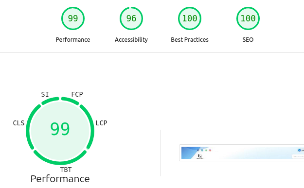

# About the App

---

Storeflow is a Next.js e-store that is easily editable and can be used for different types of stores. It has a beautiful and simple interface, a good search, filter, sort menu, and an easy admin panel for managing everything in the store, like products, categories, sales, promoted products and more.

I implemented a feature-rich admin panel where most things in the store are adjustable (e.g., categories, products, theme colors, etc.).

It uses PostgreSQL as the database, with secure authentication and administrative privileges.

---

Performance test results (Google's Lighthouse):

---

## **Storeflow E-commerce Platform: Core Features**

Storeflow is a comprehensive e-commerce platform designed with a powerful admin dashboard for store management and a user-friendly storefront for an excellent customer experience.

---

### **1. Admin Dashboard (Store Management)**

Admins have full control over the store's products, sales, and appearance.

#### **Product & Inventory**

- **Product Management:** Easily create, edit, and delete products, categories, and product bundles (sets).
- **Product Variants:** For minor differeces between the same products (e.g color, size, etc), you can add "variants" for any product.
- **Inventory Control:** Set stock levels, including "out-of-stock" and "unlimited" options. Stock is automatically updated when sets are sold.
- **Rich Content:** Use a simple HTML editor for detailed descriptions and upload both images and videos for products.

#### **Sales & Orders**

- **Financial Dashboard:** Track sales, profits, and key financial metrics.
- **Order Management:** View, approve, or reject incoming orders. Admins can add a note explaining a rejection.
- **Manual Order Entry:** Log offline purchases, which automatically updates inventory and sales data, and you can search and pick the customer's email to connect the purchase with his account (if he has an account on the website), allowing him to review the products or see the purchase details from his account.

#### **Marketing & Promotions**

- **Sales**: Set up discounts on products and sets, with a simple discount calculator.
- **Discount Codes:** Create and manage custom discount codes for customers.
- **Promotions:** Run sitewide sales and feature promotional and new items on the storefront.

#### **Store Customization**

- **Homepage Content:** Control featured categories, the main banner, and a gallery for store photos.
- **Shipping Rules:** Set custom shipping fees based on customer regions.
- **Site Information:** Easily update general content like team members and partners.
- **Site theme:** The admin can set the primary, secondary and the header banner from the Themes panel.

#### **Security Management**

- **Export/Import database backup folder:** A function for backing up or restoring the entire site database.
- **Timeout Ips:** A dashboard to manage timed-out IP addresses to block spammers.
- **Users Management:** A dashboard to view/delete accounts created on the website, and the ability to delete old unverified accounts.

---

### **2. Customer Storefront (Shopping Experience)**

A clean and intuitive interface for customers to browse, shop, and purchase.

#### **Browsing & Discovery**

- **Powerful Search:** A prominent search bar helps customers quickly find any product.
- **Advanced Filtering:** Sort and filter products by category, price, and other criteria.

#### **Shopping & Checkout**

- **Dynamic Shopping Cart:** A sidebar cart lets users easily view and manage their selected items.
- **Seamless Checkout:** A streamlined, multi-step process for placing orders.
- **Payment Options:** Includes **Cash on Delivery**, with planned support for **Credit Card** (soon) and **PayPal** (soon).
- **Printable Invoices:** Customers can generate and print PDF invoices for their orders.
- **Automated Email Notifications:** Customers automatically receive emails for important order updates (e.g., confirmation, rejection, admin's notes).
- **Reviews:** Customers will be able to leave reviews (Stars rate and a Comment) in products and sets that has been delivered.

---

### **3. User Accounts**

A dedicated area for registered customers to manage their activity.

- **Secure Authentication:** Standard email/password login, with a **Reset password** form, and support for **Google Oauth Login**.
- **Personal Dashboard:** A central "My Account" page to manage personal info, wishlists, and orders.
- **Order History & Control:** View all past orders and their current status (e.g., pending, approved). Customers can also cancel a recently placed order.
- **Wishlist:** Save favorite products for later purchase.
- **Email Confirmation:** Customer receive confirmation code on his email.

---

#### **And there's more!**

_Last updated on August 16, 2025 by Ayman._

<!-- - **Real-time Notifications:** See new orders appear instantly without needing to refresh the page. -->
<!-- - **Improved Loading:** Skeleton screens provide a faster, smoother browsing experience. -->
