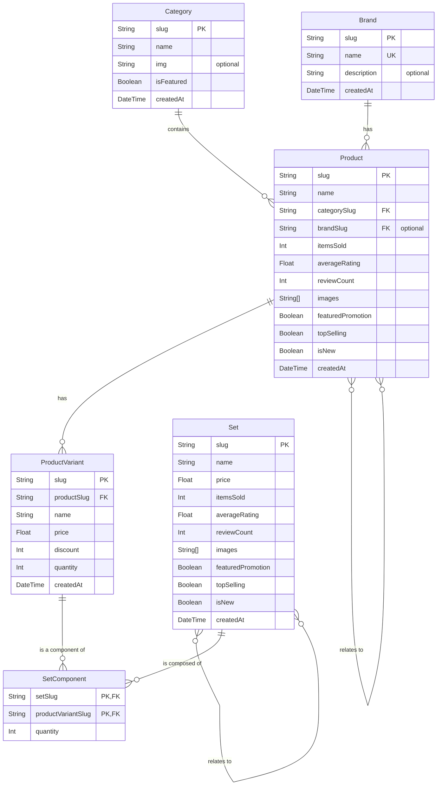
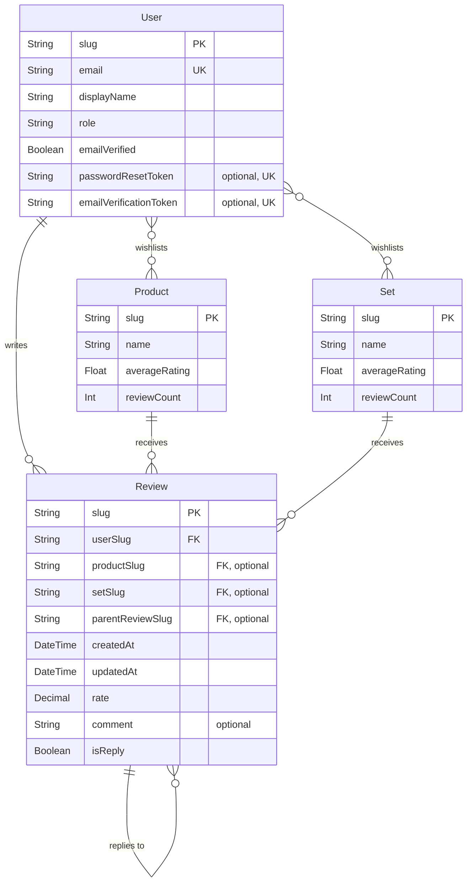
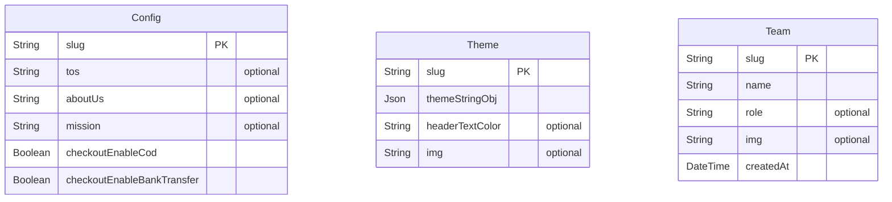
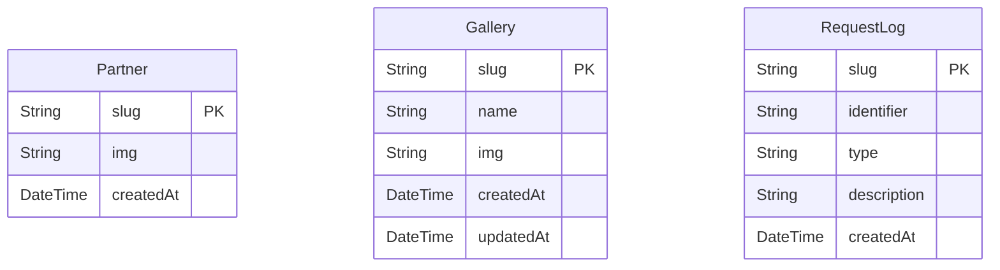

# Tech Stack & Concepts

## **Tech Stack**

- **Frontend + Backend**: React ^19.2.4 + Next.js ^15 (latest patch for v15 as of build time) (App Router).
- **Database**: PostgreSQL v16 + Prisma ^7.3.0.
- **Styling**: Tailwind CSS v4.
- **API**: Next.js API routes.
- **Mobile**: [React Native 0.8?.? + Expo ?.? (soon)](/docs/03-Setup-mobile-app/1-intro.md).
- **Deployment**: [Docker + Nginx (or other hosting services)](/docs/Setup-Store/Deployment).
- **Runtime**: Bun 1.3.
- **Push Notifications**: web-push (native library).
- **Email**: Nodemailer + Gmail SMTP (optional).

---

## **Features**

**Fully Dockerized**: The application is containerized with Docker, making deployment simple and consistent across different environments. No need to manually install PostgreSQL, Bun, or manage dependencies - just run `docker-compose up` and you're ready to go.

---

## **Core Architecture**

- **Authentication:** JWT-based sessions using HTTPS-only cookies and HS256 encryption
- **File Storage:** Local filesystem with Docker volume mounting
- **Email Service:** Nodemailer with Gmail SMTP (changeable via .env)
- **Rate Limiting:** Database-backed rate limiter for security
- **Real-time Updates:** Server-Sent Events for live order updates on the Admin panel
- **Progressive Web App (PWA):** Used @ducanh2912/next-pwa library v10.2.9

---

## **Database Schemas (Prisma)**

The single source of truth for the database structure is the `prisma/schema.prisma` file. It defines all models, relations, and indexes.

**Note: These visual diagrams are simplified, not complete, and have wrong naming; more details below.**

### Diagram 1: E-commerce & Order Processing


### Diagram 2: Product Catalog & Inventory



### Diagram 3: User Interaction & Reviews



### Diagram 4: Site Content & System





    ```mermaid

erDiagram

    TimedoutIp {
        String slug PK "IP Address"
        DateTime createdAt
        DateTime timedoutUntil
    }

     CustomTransaction {
        String slug PK
        Decimal amount
    }

Feedback {
String slug PK
DateTime createdAt
FeedbackType type
String message
Boolean isClosed
}

````

    ```mermaid

erDiagram

    Ad {
String slug PK
        DateTime createdAt
        String name
        String img
        String link
        String description
    }


````

### More details

<details>
<summary><strong>Click to expand/collapse the detailed database structure</strong></summary>

```

generator client {
  provider = "prisma-client-js"
  previewFeatures = ["fullTextSearchPostgres"]
  compilerBuild = "fast" // "fast" | "small"
}

datasource db {
  provider = "postgresql"
}

model User {
  slug                     String    @default(cuid()) @id @db.VarChar(100)
  created_at               DateTime   @default(now())
  email                    String     @unique @db.VarChar(255)
  password_hash             String?    @db.VarChar(255)
  display_name              String     @db.VarChar(100)
  is_google_auth             Boolean    @default(false)
  role                      Roles    @default(USER)
  password_reset_token       String?    @unique @db.VarChar(100)
  password_reset_expires     DateTime?
  email_verified            Boolean?   @default(false)
  email_verification_token   String?    @unique
  email_verification_expires DateTime?
  orders                   Order[]
  wishlist                 Product[]
  wishlistSets             Set[]     @relation("UserWishlistSets")
  reviews                  Review[]
  subscriptions            PushSubscription[]

  @@index([email])
  @@index([role])
  @@index([email_verified])
  @@index([email_verified, created_at])
  @@index([created_at])
}

model PushSubscription {
  slug        String   @id @default(cuid())
  endpoint  String   @unique // The unique URL for the user's browser
  keys      Json     // Stores 'p256dh' and 'auth' keys
  user_slug String   @db.VarChar(100)
  user      User     @relation(fields: [user_slug], references: [slug], onDelete: Cascade)
  created_at DateTime @default(now())

  @@index([user_slug])
}

model RequestLog {
  slug          String      @id @default(cuid())
  identifier    String
  type          String   // like "review", "checkout", "auth"
  created_at    DateTime @default(now())
  description   String   @default("")

  @@index([identifier, type])
  @@index([identifier, type, created_at])
  @@index([created_at])
}

model TimedoutIp {
  slug           String   @id // The IP address
  created_at     DateTime @default(now())
  timedout_until DateTime // The timestamp when the timeout expires

  @@index([timedout_until])
  @@index([created_at])
}

model Config {
  slug                     String   @id @default("general") @db.VarChar(50)
  tos                      String?  @default("") @db.Text
  about_us                 String?  @default("") @db.Text
  mission                  String?  @default("") @db.Text
  partners_description     String?  @default("") @db.Text
  connect_description      String?  @default("") @db.Text
  delivery_policies        String[] @default([])
  allow_email_verification Boolean  @default(true)
  checkout_enable_cod      Boolean  @default(true)
  checkout_enable_bank_transfer  Boolean  @default(false)
  bank_accounts        String[] @default(["Here are our bank accounts:-","Bank of Palestine: 1234567890"])
  // checkout_enable_credit_card Boolean  @default(false)
  // checkout_enable_paypal      Boolean  @default(false)
}

model Category {
  slug        String     @id @db.VarChar(100)
  name        String     @db.VarChar(100)
  img         String?    @default("") @db.VarChar(255)
  is_featured Boolean    @default(false)
  created_at  DateTime   @default(now())

  product    Product[]

  @@index([is_featured])
  @@index([created_at])
  @@index([is_featured, created_at]) // OPTIMIZED: Combined index for featured categories query
}

model Brand {
  slug         String     @id @db.VarChar(100)
  name         String     @unique @db.VarChar(100)
  description  String?    @db.Text
  created_at   DateTime   @default(now())

  products     Product[]

  @@index([name])
  @@index([created_at])
}

// The parent product, holds shared data
model Product {
  created_at          DateTime   @default(now())
  updated_at          DateTime   @updatedAt @default(now())
  slug                String     @id @db.VarChar(100)
  name                String     @db.VarChar(100)
  category            String     @db.VarChar(100)
  items_sold          Int        @default(0) @db.SmallInt // Total sold across all variants
  featured_promotion  Boolean    @default(false)
  top_selling         Boolean    @default(false)
  is_new              Boolean    @default(false)
  images              String[]   @default([])
  average_rating      Float      @default(0) @db.DoublePrecision
  review_count        Int        @default(0)
  description         String     @default("") @db.Text
  secret_description  String?    @default("") @db.Text
  brand_slug          String?     @db.VarChar(100)

  // DENORMALIZED
  min_price           Float      @default(0) @db.DoublePrecision
  max_price           Float      @default(0) @db.DoublePrecision
  max_discount        Int        @default(0) @db.SmallInt
  total_quantity      Int        @default(0)

  search_vector      Unsupported("tsvector")? // search by name/slug for now

  categoryRef        Category       @relation(fields: [category], references: [slug], onDelete: Cascade)
  wishlistedBy       User[]
  relatedProducts    Product[]       @relation("ProductRelations")
  relatedTo          Product[]       @relation("ProductRelations")
  reviews            Review[]
  variants           ProductVariant[] // A product has many variants
  brand              Brand?      @relation(fields: [brand_slug], references: [slug], onDelete: Restrict)

  // CORE INDEXES
  @@index([category])
  @@index([brand_slug])
  @@index([featured_promotion])
  @@index([top_selling])
  @@index([is_new])
  @@index([name])
  @@index([created_at])
  @@index([items_sold])
  @@index([average_rating])
  @@index([min_price])
  @@index([max_price])
  @@index([max_discount])
  @@index([total_quantity])

  // OPTIMIZED COMPOSITE INDEXES FOR STOCK-AWARE SORTING
  // These indexes support queries that prioritize in-stock items
  @@index([total_quantity, created_at])   // For "newest" queries with stock priority
  @@index([total_quantity, items_sold])   // For "top selling" queries with stock priority
  @@index([total_quantity, min_price])    // For price sorting with stock priority
  @@index([total_quantity, max_price])    // For price sorting (DESC) with stock priority
  @@index([total_quantity, max_discount]) // For discount sorting with stock priority
  @@index([total_quantity, average_rating]) // For rating sorting with stock priority

  // FEATURE-SPECIFIC COMPOSITE INDEXES
  @@index([featured_promotion, total_quantity, created_at]) // Featured products with stock priority
  @@index([top_selling, total_quantity, items_sold])        // Top selling with stock priority
  @@index([is_new, total_quantity, created_at])             // New products with stock priority

  // CATEGORY-SPECIFIC COMPOSITE INDEXES
  @@index([category, total_quantity, created_at])      // Category browsing with stock priority
  @@index([category, total_quantity, items_sold])      // Category top sellers
  @@index([category, total_quantity, min_price])       // Category price sorting
  @@index([category, total_quantity, average_rating])  // Category rating sorting
  @@index([category, brand_slug, total_quantity])      // Category + brand filtering
  @@index([category, featured_promotion])
  @@index([category, top_selling])

  // BRAND-SPECIFIC INDEX
  @@index([brand_slug, total_quantity, created_at]) // Brand browsing with stock priority
}

model ProductVariant {
  slug        String  @id @db.VarChar(150) // e.g., "headphones-white-large"
  product_slug String  @db.VarChar(100)
  name        String  @db.VarChar(100) // e.g., "White, Large"
  price       Float   @db.DoublePrecision
  discount    Int     @default(0) @db.SmallInt
  quantity    Int     @default(0) @db.SmallInt
  created_at  DateTime @default(now())
  description String?  @db.Text
  preferred_img_index Int?  @default(0) @db.SmallInt

  product     Product     @relation(fields: [product_slug], references: [slug], onDelete: Cascade)
  orderItems  OrderItem[]
  setComponents SetComponent[]

  @@index([product_slug])
  @@index([price])
  @@index([quantity])
  @@index([discount])
  @@index([product_slug, discount, price]) // OPTIMIZED: For variant selection with discount priority
  @@index([product_slug, quantity])        // OPTIMIZED: For stock checks
  @@index([quantity, price])               // OPTIMIZED: For in-stock variant searches
}

model Review {
  slug         String    @id @default(cuid())
  created_at   DateTime  @default(now())
  updated_at   DateTime  @updatedAt
  rate         Decimal   @default(0) @db.Decimal(2, 1)
  comment      String?   @db.VarChar(255)
  product_slug String?   @db.VarChar(100)
  set_slug     String?   @db.VarChar(100)
  user_slug    String    @db.VarChar(100)

  // Reply functionality
  parent_review_slug String? @db.VarChar(150)
  is_reply           Boolean @default(false)

  // Relations
  product      Product?  @relation(fields: [product_slug], references: [slug], onDelete: Cascade)
  set          Set?      @relation(fields: [set_slug], references: [slug], onDelete: Cascade)
  user         User      @relation(fields: [user_slug], references: [slug], onDelete: Cascade)

  // Self-referential relation for replies
  parent_review Review?   @relation("ReviewReplies", fields: [parent_review_slug], references: [slug], onDelete: Cascade)
  replies       Review[]  @relation("ReviewReplies")

  @@index([user_slug])
  @@index([created_at])
  @@index([product_slug, is_reply, updated_at]) // OPTIMIZED: Combined for review listing
  @@index([set_slug, is_reply, updated_at])     // OPTIMIZED: Combined for review listing
  @@index([parent_review_slug])
}

model Set {
  slug               String          @id @db.VarChar(100)
  name               String          @db.VarChar(100)
  images             String[]        @default([])
  made_by            String          @db.VarChar(100)
  description        String          @default("")
  tags               String[]        @default([])
  created_at         DateTime        @default(now())
  updated_at         DateTime        @updatedAt @default(now())
  price              Float           @default(0) @db.DoublePrecision
  discount           Float           @default(0) @db.DoublePrecision
  items_sold         Int             @default(0) @db.SmallInt
  featured_promotion Boolean         @default(false)
  top_selling        Boolean         @default(false)
  is_new             Boolean         @default(false)
  average_rating      Float           @default(0) @db.DoublePrecision
  review_count        Int             @default(0)

  components         SetComponent[]
  orderItems         OrderItem[]
  relatedProducts   Set[]          @relation("SetRelations")
  relatedTo         Set[]          @relation("SetRelations")
  wishlistedBy       User[]         @relation("UserWishlistSets")
  reviews            Review[]

  @@index([made_by])
  @@index([name])
  @@index([created_at])
  @@index([price])
  @@index([discount])
  @@index([items_sold])
  @@index([featured_promotion])
  @@index([top_selling])
  @@index([is_new])
  @@index([average_rating])

  // OPTIMIZED COMPOSITE INDEXES FOR SETS
  @@index([featured_promotion, created_at]) // Featured sets listing
  @@index([top_selling, items_sold])        // Top selling sets
  @@index([is_new, created_at])             // New sets listing
}

model SetComponent {
  set_slug           String @db.VarChar(100)
  product_variant_slug String @db.VarChar(150)
  quantity          Int    @db.SmallInt

  set     Set           @relation(fields: [set_slug], references: [slug], onDelete: Cascade)
  variant ProductVariant @relation(fields: [product_variant_slug], references: [slug], onDelete: Cascade)

  @@id([set_slug, product_variant_slug])
  @@index([set_slug])
  @@index([product_variant_slug])
}

model Team {
  slug       String   @id @db.VarChar(100)
  name       String   @db.VarChar(100)
  role       String?  @db.VarChar(100)
  img        String?  @db.VarChar(255)
  created_at DateTime @default(now())

  @@index([created_at])
}

model Partner {
  slug       String   @id @db.VarChar(100)
  img        String   @db.VarChar(255)
  created_at DateTime @default(now())

  @@index([created_at])
}

model Gallery {
  created_at DateTime @default(now())
  updated_at DateTime @updatedAt
  slug       String   @id @db.VarChar(100)
  name       String   @db.VarChar(100)
  img        String   @db.VarChar(255)

  @@index([created_at])
  @@index([updated_at])
}

model Theme {
  slug            String   @id @default("general") @db.VarChar(50)
  theme_string_obj  Json     @default("{\"primary\":\"blue\",\"secondary\":\"violet\"}")
  header_text_color String?  @default("text-black") @db.VarChar(100)
  img             String?  @default("") @db.VarChar(255)
}

model Order {
  slug           String   @id @db.VarChar(100)
  created_at     DateTime @default(now())
  name           String   @db.VarChar(100)
  email          String   @db.VarChar(255)
  address        String   @db.VarChar(255)
  city           String   @db.VarChar(100)
  region         String?  @db.VarChar(100)
  postal_code    String?  @db.VarChar(20)
  notes          String?  @db.VarChar(500)
  payment_method String   @db.VarChar(50)
  shipping_fee   Decimal  @db.Decimal(10, 2)
  sub_total      Decimal  @db.Decimal(10, 2)
  phone          String   @db.VarChar(20)
  status         String   @db.VarChar(20)
  admin_note     String?  @db.Text
  items_qty      Int      @db.SmallInt

  discount_code   String?        @db.VarChar(70)
  discount_amount Decimal        @default(0) @db.Decimal(10, 2)
  idempotency_key  String?        @unique @db.VarChar(100)

  user            User          @relation(fields: [email], references: [email], onDelete: Cascade)
  orderItems      OrderItem[]
  discountCodeRef DiscountCode? @relation("OrderDiscountCode", fields: [discount_code], references: [slug])

  @@index([created_at])
  @@index([email])
  @@index([status])
  @@index([discount_code])

  // OPTIMIZED COMPOSITE INDEXES FOR ORDER QUERIES
  @@index([status, created_at])        // OPTIMIZED: For dashboard revenue queries (delivered orders)
  @@index([email, status, created_at]) // OPTIMIZED: User order history with status filter
  @@index([status, email])             // OPTIMIZED: Alternative for user status queries
}

model OrderItem {
  slug               String  @id @default(cuid())
  order_slug         String  @db.VarChar(100)
  product_variant_slug String? @db.VarChar(150)
  set_slug           String? @db.VarChar(100)
  item_type          ItemType
  quantity           Int     @db.SmallInt
  unit_price         Decimal @db.Decimal(10, 2)

  order   Order          @relation(fields: [order_slug], references: [slug], onDelete: Cascade)
  variant ProductVariant? @relation(fields: [product_variant_slug], references: [slug], onDelete: Cascade)
  set     Set?           @relation(fields: [set_slug], references: [slug], onDelete: Cascade)

  @@unique([order_slug, product_variant_slug, set_slug])
  @@index([order_slug])
  @@index([product_variant_slug])
  @@index([set_slug])
  @@index([item_type])
}

model DiscountCode {
  slug                 String    @id @db.VarChar(70)
  created_at           DateTime  @default(now())
  expires_at           DateTime?
  discount_type        String    @db.VarChar(20)
  discount_value       Decimal   @db.Decimal(10, 2)
  max_uses             Int?      @db.SmallInt
  used_count           Int       @default(0) @db.SmallInt
  minimum_order_amount Decimal?  @db.Decimal(10, 2)
  is_active            Boolean   @default(true)
  orders               Order[]  @relation("OrderDiscountCode")

  @@index([slug])
  @@index([created_at])
  @@index([is_active, expires_at]) // OPTIMIZED: For validating active discount codes
}

model CustomTransaction {
  slug        String   @id @default("general")
  amount      Decimal  @db.Decimal(10, 2)
}

model Feedback {
  created_at   DateTime     @default(now())
  slug         String       @id @default(cuid())
  type         FeedbackType
  message      String       @db.Text
  is_closed    Boolean      @default(false)

  @@index([created_at])
  @@index([is_closed])
  @@index([is_closed, created_at]) // OPTIMIZED: For filtering open/closed feedback
}

model Ad {
  created_at   DateTime     @default(now())
  slug         String       @id
  name         String?     @default("")
  link         String?     @default("")
  img          String?     @default("") @db.VarChar(255)
  description  String?     @default("") @db.Text

  @@index([created_at])
}

enum ItemType {
  PRODUCT
  SET
}

enum FeedbackType {
  BUG
  FEATURE
  IMPROVEMENT
  GENERAL
}

enum Roles {
  USER
  PRODUCTS_MANAGER
  ORDERS_MANAGER
  CONTENT_MANAGER
  ADMIN
}

```

</details>

---

## **Folder Structure**

This project uses the **Next.js App Router**, which organizes the application files within the `src/app` directory, this section shows some of the project's files.

<details>
<summary><strong>Click to expand/collapse details of the folder structure</strong></summary>

- **Root Directory (`/`)**

```bash
.
├── mobile
│   ├── app
│   │   ├── (drawer)
│   │   │   ├── _layout.tsx
│   │   │   └── (tabs)
│   │   │       ├── account.tsx
│   │   │       ├── index.tsx
│   │   │       ├── _layout.tsx
│   │   │       ├── login.tsx
│   │   │       ├── sets.tsx
│   │   │       ├── store.tsx
│   │   │       └── tos.tsx
│   │   ├── _layout.tsx
│   │   └── +not-found.tsx
│   ├── app-env.d.ts
│   ├── app.json
│   ├── assets
│   │   ├── fonts
│   │   │   └── SpaceMono-Regular.ttf
│   │   └── images
│   │       ├── adaptive-icon.png
│   │       ├── anonymous.png
│   │       ├── favicon.png
│   │       ├── icon.png
│   │       ├── image-placeholder.png
│   │       └── splash-icon.png
│   ├── babel.config.js
│   ├── cesconfig.jsonc
│   ├── components
│   │   ├── BrandFilterDropdown.tsx
│   │   ├── ContactBox.tsx
│   │   ├── Footer.tsx
│   │   ├── ItemsSlider.tsx
│   │   ├── Logo.tsx
│   │   ├── MediaDisplay.tsx
│   │   ├── MultiRangeSlider.tsx
│   │   ├── NewTag.tsx
│   │   ├── Pagination.tsx
│   │   ├── SearchForm.tsx
│   │   ├── Spinner.tsx
│   │   ├── StarRating.tsx
│   │   ├── Typography.tsx
│   │   └── Underline.tsx
│   ├── constants
│   │   ├── config.ts
│   │   ├── language.ts
│   │   └── types
│   │       ├── data.d.ts
│   │       └── general.ts
│   ├── context
│   │   └── AppDataContext.tsx
│   ├── eslint.config.js
│   ├── global.css
│   ├── hooks
│   │   ├── useApi.ts
│   │   └── useDebounce.ts
│   ├── metro.config.js
│   ├── nativewind-env.d.ts
│   ├── package.json
│   ├── prettier.config.js
│   ├── styles
│   │   └── colors.ts
│   ├── tailwind.config.js
│   ├── tsconfig.json
│   └── utils
│       ├── api.ts
│       └── functions.ts
└── web
    ├── backups
    ├── db
    ├── docker-compose.dev.yml
    ├── docker-compose.yml
    ├── docker-entrypoint.sh
    ├── Dockerfile
    ├── jsconfig.json
    ├── next.config.mjs
    ├── package.json
    ├── postcss.config.mjs
    ├── prisma
    │   └── schema.prisma
    ├── prisma.config.ts
    ├── public
    │   ├── android-chrome-192x192.png
    │   ├── android-chrome-512x512.png
    │   ├── apple-touch-icon.png
    │   ├── favicon-16x16.png
    │   ├── favicon-32x32.png
    │   ├── favicon.ico
    │   ├── help-page
    │   │   ├── help-auto-slug.png
    │   │   ├── help-copy-html-1.png
    │   │   ├── help-copy-html-2.png
    │   │   ├── help-copy-html-3.png
    │   │   ├── help-html-example.png
    │   │   ├── help-open-html-editor-1.png
    │   │   ├── help-open-html-editor-2.png
    │   │   ├── help-order-life-cycle-1.png
    │   │   ├── help-order-life-cycle-2.png
    │   │   ├── help-roles-1.png
    │   │   └── help-slug-in-url.png
    │   ├── icon-192.png
    │   ├── icon-2.png
    │   ├── icon-512.png
    │   ├── icon.png
    │   ├── manifest.json
    │   ├── push-sw.js
    │   ├── site.webmanifest
    │   ├── TEST_ICON.png
    │   └── uploads
    ├── setup-files
    │   ├── manage-users.js
    │   └── store-customization.pdf
    └── src
        ├── actions
        │   ├── adminPush.js
        │   ├── authActions.js
        │   └── reviewActions.js
        ├── app
        │   ├── about
        │   │   └── page.js
        │   ├── account
        │   │   ├── layout.js
        │   │   ├── orders
        │   │   │   ├── page.js
        │   │   │   └── [slug]
        │   │   │       └── page.js
        │   │   ├── page.js
        │   │   └── wishlist
        │   │       └── page.js
        │   ├── admin
        │   │   ├── components
        │   │   │   ├── ActiveUsers.js
        │   │   │   ├── AdminHeader.js
        │   │   │   ├── AutoSlugifyButton.js
        │   │   │   ├── Backup.js
        │   │   │   ├── CustomTransaction.js
        │   │   │   ├── Dashboard.js
        │   │   │   ├── DiscountCalculator.js
        │   │   │   ├── DynamicExportModal.js
        │   │   │   ├── DynamicImportModal.js
        │   │   │   ├── Feedback.js
        │   │   │   ├── forms
        │   │   │   │   ├── AdForm.js
        │   │   │   │   ├── BrandForm.js
        │   │   │   │   ├── CashierForm.js
        │   │   │   │   ├── CategoryForm.js
        │   │   │   │   ├── CodesForm.js
        │   │   │   │   ├── FormWrapper.js
        │   │   │   │   ├── GalleryForm.js
        │   │   │   │   ├── GeneralForm.js
        │   │   │   │   ├── PartnersForm.js
        │   │   │   │   ├── ProductForm.js
        │   │   │   │   ├── PushForm.js
        │   │   │   │   ├── SetForm.js
        │   │   │   │   ├── TeamForm.js
        │   │   │   │   └── ThemesForm.js
        │   │   │   ├── Help.js
        │   │   │   ├── HtmlEditor.js
        │   │   │   ├── ImageList.js
        │   │   │   ├── NavigationTabs.js
        │   │   │   ├── OrdersQuickStats.js
        │   │   │   ├── OrderView.js
        │   │   │   ├── RelatedItemsSection.js
        │   │   │   ├── ResetForm.js
        │   │   │   ├── ReviewView.js
        │   │   │   ├── RoleCell.js
        │   │   │   ├── SearchProduct.js
        │   │   │   ├── SpamManagement.js
        │   │   │   ├── table
        │   │   │   │   ├── TableComponents.js
        │   │   │   │   └── tableConfigs.js
        │   │   │   ├── TableDisplay.js
        │   │   │   └── ui
        │   │   │       ├── Badge.js
        │   │   │       ├── Button.js
        │   │   │       ├── Card.js
        │   │   │       ├── EmptyState.js
        │   │   │       ├── FormField.js
        │   │   │       ├── index.js
        │   │   │       └── LoadingState.js
        │   │   ├── hooks
        │   │   │   ├── useDebouncedSearch.js
        │   │   │   ├── useEntityData.js
        │   │   │   └── useFormSubmit.js
        │   │   ├── layout.js
        │   │   ├── page.js
        │   │   ├── styles
        │   │   │   └── admin.css
        │   │   └── utils
        │   │       ├── api-helpers.js
        │   │       ├── constants.js
        │   │       ├── form-helpers.js
        │   │       └── image-helpers.js
        │   ├── api
        │   │   ├── admin
        │   │   │   ├── backup
        │   │   │   │   └── route.js
        │   │   │   ├── change-role
        │   │   │   │   └── route.js
        │   │   │   ├── excel
        │   │   │   │   ├── export-data
        │   │   │   │   │   └── route.js
        │   │   │   │   └── import-data
        │   │   │   │       └── route.js
        │   │   │   ├── geo
        │   │   │   │   └── route.js
        │   │   │   ├── online-users
        │   │   │   │   └── route.js
        │   │   │   └── verify-user
        │   │   │       └── route.js
        │   │   ├── auth
        │   │   │   ├── me
        │   │   │   │   └── route.js
        │   │   │   └── route.js
        │   │   ├── cleanup
        │   │   │   └── route.js
        │   │   ├── custom-transactions
        │   │   │   └── route.js
        │   │   ├── feedback
        │   │   │   └── route.js
        │   │   ├── healthcheck
        │   │   │   └── route.js
        │   │   ├── live
        │   │   │   └── route.js
        │   │   ├── pages-data
        │   │   │   └── [page]
        │   │   │       └── route.js
        │   │   ├── push
        │   │   │   ├── subscribe
        │   │   │   │   └── route.js
        │   │   │   └── unsubscribe
        │   │   │       └── route.js
        │   │   ├── tables
        │   │   │   ├── route.js
        │   │   │   └── [table]
        │   │   │       └── [slug]
        │   │   │           └── route.js
        │   │   ├── uploads
        │   │   │   └── [...path]
        │   │   │       └── route.js
        │   │   └── user
        │   │       ├── orders
        │   │       │   └── route.js
        │   │       └── wishlist
        │   │           ├── route.js
        │   │           └── [slug]
        │   │               └── route.js
        │   ├── checkout
        │   │   ├── layout.js
        │   │   └── page.js
        │   ├── contact
        │   │   └── page.js
        │   ├── error.js
        │   ├── feedback
        │   │   └── page.js
        │   ├── layout.js
        │   ├── loading.js
        │   ├── login
        │   │   ├── layout.js
        │   │   └── page.js
        │   ├── not-found.js
        │   ├── page.js
        │   ├── sets
        │   │   ├── page.js
        │   │   └── [slug]
        │   │       └── page.js
        │   ├── sitemap.js
        │   ├── store
        │   │   ├── page.js
        │   │   └── [slug]
        │   │       └── page.js
        │   └── tos
        │       └── page.js
        ├── assets
        │   └── header-bg.png
        ├── components
        │   ├── account-components
        │   │   ├── MenuLink.js
        │   │   ├── OrderActions.js
        │   │   ├── Orders.js
        │   │   ├── SignOutButton.js
        │   │   ├── WishlistActions.js
        │   │   └── Wishlist.js
        │   ├── home-components
        │   │   ├── HomeListItems.js
        │   │   ├── HomePageSlider.js
        │   │   ├── Partners.js
        │   │   ├── PromotedComponent.js
        │   │   ├── Promotions.js
        │   │   ├── ScrollControls.js
        │   │   └── ScrollDots.js
        │   ├── others-components
        │   │   ├── Activity.js
        │   │   ├── CartSidebar.js
        │   │   ├── Checkbox.js
        │   │   ├── ContactBox.js
        │   │   ├── CopyBtn.js
        │   │   ├── ExpandableGallery.js
        │   │   ├── FeatureOffOverlay.js
        │   │   ├── FloatingCartButton.js
        │   │   ├── Footer.js
        │   │   ├── HeaderAccount.js
        │   │   ├── HeaderForm.js
        │   │   ├── Header.js
        │   │   ├── Invoice.js
        │   │   ├── Logo.js
        │   │   ├── MediaDisplay.js
        │   │   ├── MobileNav.js
        │   │   ├── NavLink.js
        │   │   ├── NavWrapper.js
        │   │   ├── NotificationPermissionBtn.js
        │   │   ├── OnlineHeartbeat.js
        │   │   ├── OpenCartBtn.js
        │   │   ├── SetsPagnination.js
        │   │   ├── Spinner.js
        │   │   ├── Stars.js
        │   │   ├── SystemTimeChecker.js
        │   │   └── ThemeScript.js
        │   └── store-components
        │       ├── BrandDescription.js
        │       ├── ExpandableWrapper.js
        │       ├── ImageSelect.js
        │       ├── NewTag.js
        │       ├── ProductCard.js
        │       ├── ProductCardVariantsStatus.js
        │       ├── ProductDescription.js
        │       ├── ProductForm.js
        │       ├── ProductsGridSkeleton.js
        │       ├── RelatedProducts.js
        │       ├── RelatedSets.js
        │       ├── ReviewsForm.js
        │       ├── ReviewsItem.js
        │       ├── ReviewsList.js
        │       ├── ReviewsReplyForm.js
        │       └── StoreFilterOptions.js
        ├── context
        │   ├── AuthContext.js
        │   ├── ConfirmModal.js
        │   └── WishlistContext.js
        ├── helpers
        │   ├── client-functions.js
        │   ├── config.js
        │   ├── functions.js
        │   ├── language-en.js
        │   ├── language.js
        │   └── server-functions.js
        ├── hooks
        │   ├── useHeartbeat.js
        │   ├── useIsMobile.js
        │   ├── useOutsideClick.js
        │   └── usePushNotifications.js
        ├── lib
        │   ├── auth.js
        │   ├── backup.js
        │   ├── data.js
        │   ├── db.js
        │   ├── email.js
        │   ├── event-emitter.js
        │   ├── get-ip.js
        │   ├── notifications.js
        │   ├── online-tracking.js
        │   ├── order-operations.js
        │   ├── pages-data.js
        │   ├── permissions.js
        │   ├── rate-limiter-db.js
        │   ├── review.js
        │   ├── session.js
        │   └── wishlist.js
        ├── middleware.js
        └── styles
            ├── globals.css
            └── react-paginate.css
```

<!--
tree -I '.DS_Store|*.orig.*|node_modules|package-lock.js
on|.pnp|.pnp.*|.yarn|.env.*|*.pem|*.jks|*.p8|*.p12|*.key|*.mobileprovi
sion|*debug.log*|*error.log*|.next|out|build|.vercel|*.tsbuildinfo|nex
t-env.d.ts|dev.db|generated|migrations|coverage|backups|uploads|temp|.
expo|dist|web-build|.metro-health-check*|ios|android|.docusaurus|.cach
e-loader'

or:

tree --gitignore -I "temp"
-->

</details>

---

_Last updated on February 4, 2026 by Ayman._
