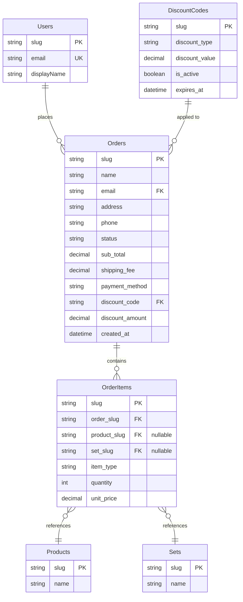
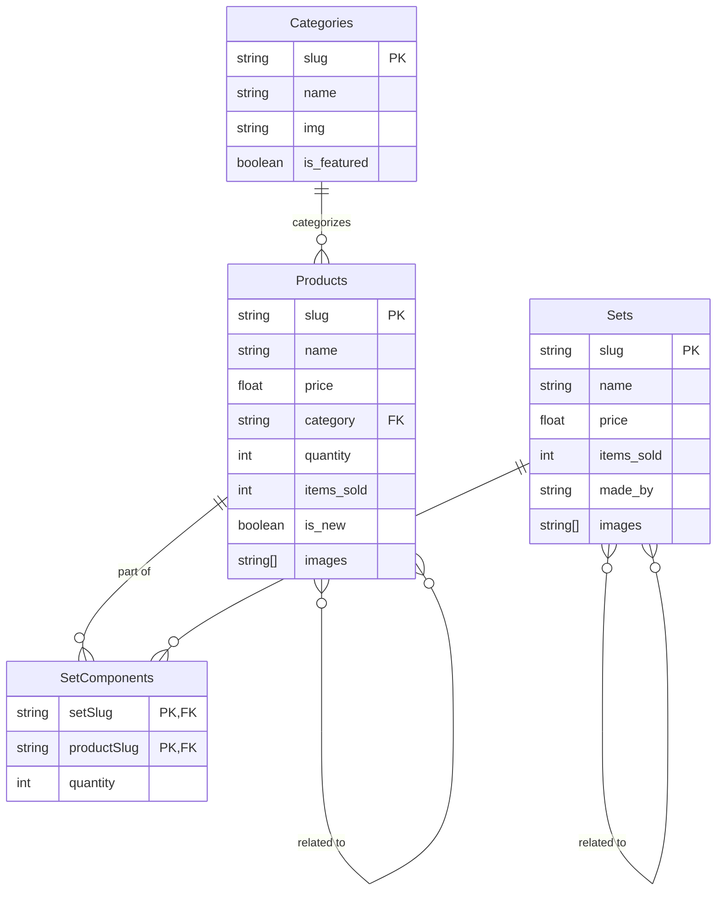
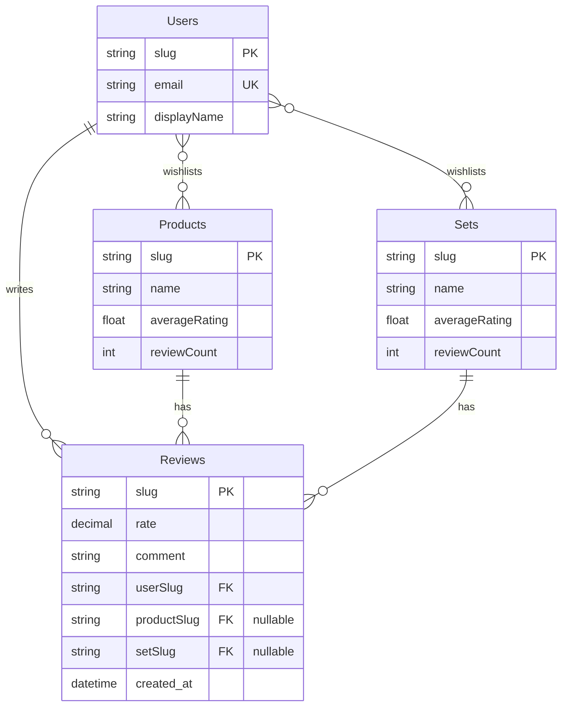
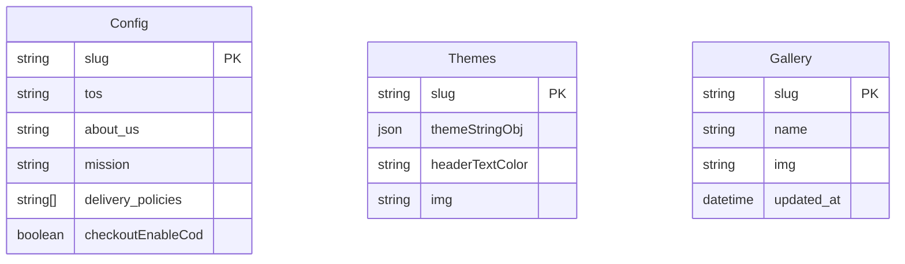
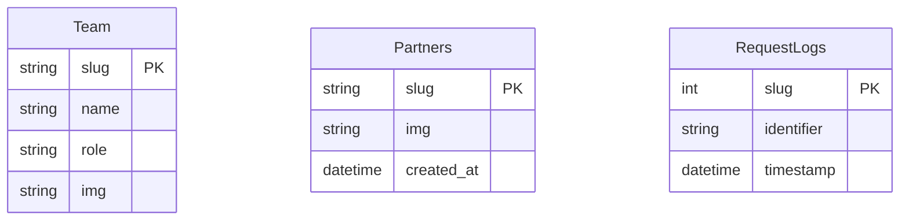

# Tech Stack & Concepts

## Tech Stack

- Frontend + Backend: Next.js

- Database: PostgreSQL, Prisma.

- Styling: Tailwind CSS

- API: Next.js API routes

- [Deployment: Vercel / Asura Hosting (soon)](/docs/Getting-Started/Deployment)

---

## **Database Schemas (Prisma)**

The single source of truth for the database structure is the `prisma/schema.prisma` file. It defines all models, relations, and indexes.

### Diagram 1: E-commerce & Order Processing

---

### Diagram 2: Product Catalog & Inventory

---

### Diagram 3: User Interaction & Reviews

---

### Diagram 4: Site Content & System

---

## **Folder Structure**

This project uses the **Next.js App Router**, which organizes the application files within the `src/app` directory, this section shows some of the project's files.

<strong>Click to expand/collapse the detailed folder structure</strong>

- **Root Directory (`/`)**

  - `.env.local`: **(Untracked)** Local environment variables. Contains secrets like database URLs and API keys.
  - `.env.local.example`: An example file for environment variables. New developers should copy this to `.env.local`.
  - `.eslintrc.json`: Configuration for ESLint, our code linter.
  - `.gitignore`: Specifies files and folders to be ignored by Git (e.g., `node_modules`, `.env.local`).
  - `jsconfig.json`: Configures path aliases (e.g., `@/components`) for easier imports.
  - `next.config.mjs`: The main configuration file for Next.js.
  - `package.json`: Lists project dependencies, metadata, and scripts (e.g., `npm run dev`).
  - `postcss.config.mjs`: Configuration for PostCSS, used by Tailwind CSS.
  - `README.md`: This documentation file.

- **`backups/`**: Directory for storing database or application backups. _(Note: This should typically be in `.gitignore` to avoid committing large backup files to the repository)._

- **`prisma/`**: Contains all database-related configurations for the Prisma ORM.

  - `schema.prisma`: The primary schema file defining all database models and relations.
  - `dev.db`: **(Untracked)** A local SQLite database file, likely used for development.

- **`public/`**: Stores static assets that are publicly accessible from the root URL.
- **`uploads/`**: Stores assets of the store's items.

  - `icon.png`: Application icon, likely used as a favicon.

- **`setup-files/`**: Contains utility scripts for project setup or maintenance.

  - `manage-users.js`: A script to create fake accounts for testing and grant/revoke admin privileges from any account.
  - `seed-fake-info.js`: A script to populate the database with dummy data for testing.

- **`src/`**: The main source code for the entire application.
  <!-- - `middleware-out.js`: A build artifact from Next.js middleware compilation. -->

  - **`app/`**: The core of the Next.js application, using the App Router.
    - `layout.js`, `page.js`, `error.js`, `loading.js`, `not-found.js`: Root-level special files that define the main layout, homepage, and global states.
    - **`about/`**: The "About Us" page.
    - **`account/`**: The user's private account section.
      - `orders/`: Displays a user's order history and details for a specific order (`[slug]`).
      - `wishlist/`: The user's product wishlist.
    - **`admin/`**: The protected admin dashboard for managing the store.
      - `components/`: React components used exclusively within the admin dashboard.
        - `forms/`: A well-organized set of forms for creating/editing every data model (Products, Categories, etc.).
      - `hooks/`: Custom React hooks specific to the admin panel.
      - `utils/`: Helper functions for admin-related tasks.
    - **`api/`**: Backend API endpoints (Route Handlers).
      - `auth/`: Handles user authentication (login, signout, session check).
      - `backup/`: API endpoint to trigger a server backup.
      - `uploads/[...path]`: API endpoint to get uploaded files.
      - `cron/`: Endpoints designed to be called by scheduled jobs (e.g., cleanup tasks).
      - `tables/`: A generic, dynamic API for performing CRUD operations on database tables, likely used by the admin panel.
      - `user/`: API routes for user-specific actions like managing wishlists and orders.
    - **`checkout/`**: The order checkout page and flow.
    - **`contact/`**: The "Contact Us" page.
    - **`login/`**: The user login page.
    - **`sets/`**: Pages for displaying product sets/bundles.
    - **`store/`**: The main product browsing pages, including the main store page and individual product detail pages (`[slug]`).
    - **`tos/`**: The "Terms of Service" page.
  - **`actions/`**: Contains Next.js Server Actions, used for server-side form submissions and mutations.
    - `authActions.js`: Server actions related to authentication.
    - `reviews.js`: Server actions related to reviews.
  - **`assets/`**: Static assets like images and fonts that are part of the build process.
  - **`components/`**: Global, reusable React components shared across the application.
    - `account-components/`: Components specific to the user account section.
    - `home-components/`: Components used only on the homepage.
    - `others-components/`: Common, shared components like `Header`, `Footer`, `Spinner`, etc.
    - `store-components/`: Components used in the product browsing and detail pages.
  - **`context/`**: React Context providers for managing global state.
    - `ConfirmModal.js`: A context for a global confirmation dialog.
  - **`helpers/`**: General-purpose utility functions that are not tied to a specific framework feature.
  - **`hooks/`**: Global, reusable React hooks.
  - **`lib/`**: Core library code, services, and backend utilities.
    - `auth.js`, `session.js`: Core authentication logic.
    - `db.js`: Initializes and exports the Prisma client instance.
    - `email.js`: Service for sending emails.
    - `rate-limiter-db.js`: Logic for API rate limiting.
    - `...and more`
  - **`styles/`**: Global stylesheets.
    - `globals.css`: Main stylesheet for Tailwind CSS and other global styles.

---

_Last updated on July 7, 2025 by Ayman._
