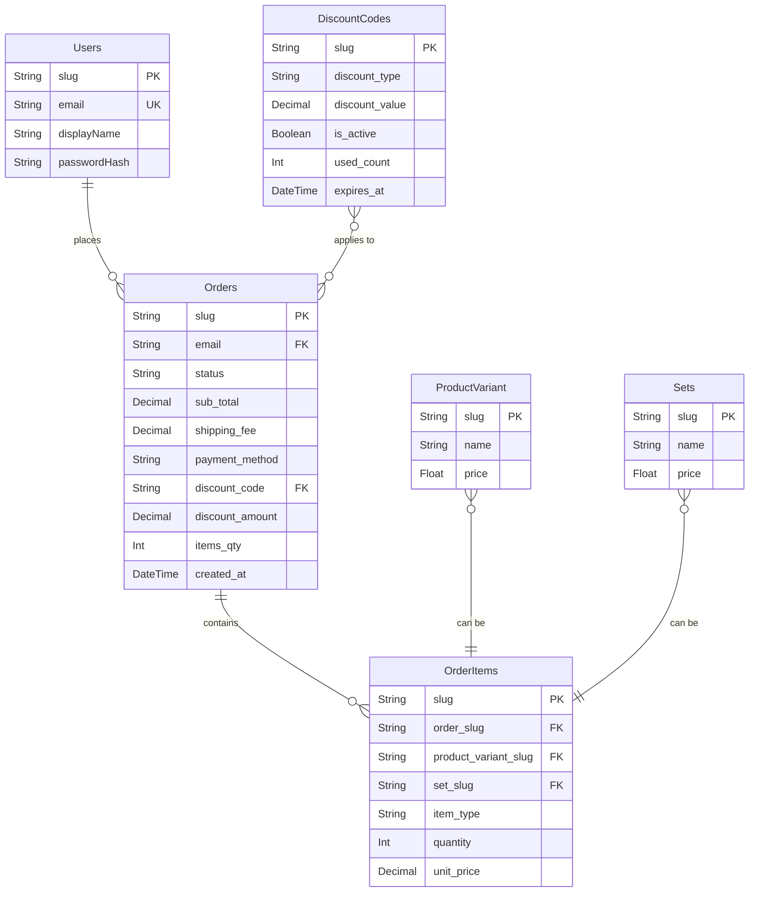
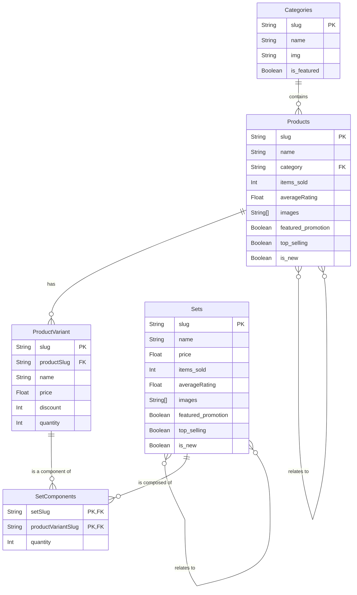
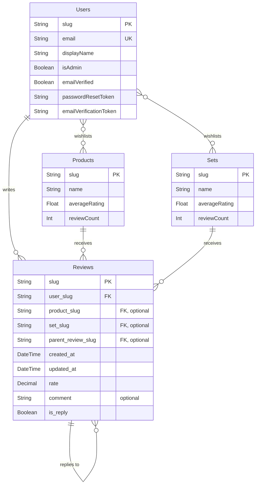
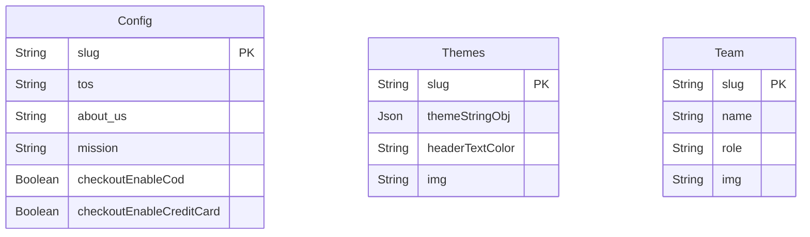
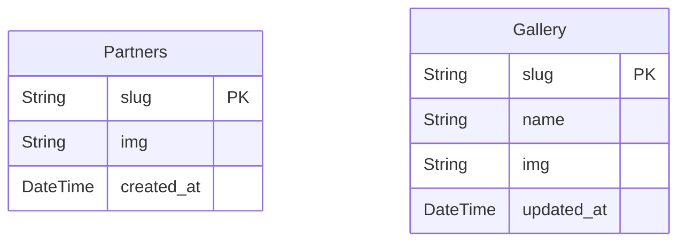
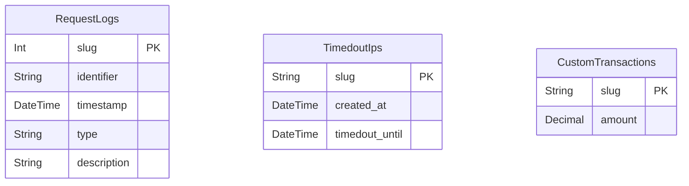

# Tech Stack & Concepts

## Tech Stack

- Frontend + Backend: Next.js v15.5.0 (App Router)

- Database: PostgreSQL v16.9 + Prisma v6.16.1

- Styling: Tailwind CSS v4

- API: Next.js API routes

- [Deployment: Vercel / Asura Hosting (soon)](/docs/Setup-Store/Deployment)

---

## **Database Schemas (Prisma)**

The single source of truth for the database structure is the `prisma/schema.prisma` file. It defines all models, relations, and indexes.

### Diagram 1: E-commerce & Order Processing



### Diagram 2: Product Catalog & Inventory



### Diagram 3: User Interaction & Reviews



### Diagram 4: Site Content & System







### **More details**

<details>
<summary><strong>Click to expand/collapse the detailed database structure</strong></summary>

```
generator client {
  provider = "prisma-client-js"
  output   = "./generated/prisma"
  previewFeatures = ["fullTextSearchPostgres"]
}

datasource db {
  provider = "postgresql"
  url      = env("DATABASE_URL")
}

model Users {
  slug                     String    @default(cuid()) @id @db.VarChar(100)
  created_at               DateTime   @default(now())
  email                    String     @unique @db.VarChar(255)
  password_hash             String?    @db.VarChar(255)
  display_name              String     @db.VarChar(100)
  is_google_auth             Boolean    @default(false)
  is_admin                  Boolean    @default(false)
  password_reset_token       String?    @unique @db.VarChar(100)
  password_reset_expires     DateTime?
  email_verified            Boolean?   @default(false)
  email_verification_token   String?    @unique
  email_verification_expires DateTime?
  orders                   Orders[]
  wishlist                 Products[]
  wishlistSets             Sets[]     @relation("UserWishlistSets")
  reviews                  Reviews[]

  @@index([email])
  @@index([is_admin])
  @@index([email_verified])
  @@index([email_verified, created_at])
  @@index([created_at])
}

model RequestLogs {
  slug          Int      @id @default(autoincrement())
  identifier    String
  type          String   // "review", "checkout", "auth"
  created_at    DateTime @default(now())
  description   String   @default("")

  @@index([identifier, type])
  @@index([identifier, type, created_at])
  @@index([created_at])
}

model TimedoutIps {
  slug           String   @id // The IP address
  created_at     DateTime @default(now())
  timedout_until DateTime // The timestamp when the timeout expires

  @@index([timedout_until])
  @@index([created_at])
}

model Config {
  slug                     String   @id @default("general") @db.VarChar(50)
  tos                      String?  @default("") @db.Text
  about_us                 String?  @default("") @db.Text
  mission                  String?  @default("") @db.Text
  partners_description     String?  @default("") @db.Text
  connect_description      String?  @default("") @db.Text
  delivery_policies        String[] @default([])
  checkout_enable_cod      Boolean  @default(true)
  // checkout_enable_credit_card Boolean  @default(false)
  // checkout_enable_paypal      Boolean  @default(false)
}

model Categories {
  slug        String     @id @db.VarChar(100)
  name        String     @db.VarChar(100)
  img         String?    @default("") @db.VarChar(255)
  is_featured Boolean    @default(false)
  created_at  DateTime   @default(now())

  product    Products[]

  @@index([is_featured])
  @@index([created_at])
}

// The parent product, holds shared data
model Products {
  created_at          DateTime   @default(now())
  slug                String     @id @db.VarChar(100)
  name                String     @db.VarChar(100)
  category            String     @db.VarChar(100)
  items_sold          Int        @default(0) @db.SmallInt // Total sold across all variants
  featured_promotion  Boolean    @default(false)
  top_selling         Boolean    @default(false)
  is_new              Boolean    @default(false)
  images              String[]   @default([])
  average_rating      Float      @default(0) @db.DoublePrecision
  review_count        Int        @default(0)
  description         String     @default("") @db.Text
  secret_description  String?    @default("") @db.Text

  // DENORMALIZED
  min_price           Float      @default(0) @db.DoublePrecision
  max_price           Float      @default(0) @db.DoublePrecision
  max_discount        Int        @default(0) @db.SmallInt

  search_vector      Unsupported("tsvector")?

  categoryRef        Categories       @relation(fields: [category], references: [slug], onDelete: Cascade)
  wishlistedBy       Users[]
  relatedProducts    Products[]       @relation("ProductRelations")
  relatedTo          Products[]       @relation("ProductRelations")
  reviews            Reviews[]
  variants           ProductVariant[] // A product has many variants

  @@index([category])
  @@index([featured_promotion])
  @@index([top_selling])
  @@index([is_new])
  @@index([name])
  @@index([created_at])
  @@index([items_sold])
  @@index([average_rating])
  @@index([min_price])
  @@index([max_price])
  @@index([max_discount])

  @@index([category, name])
  @@index([category, top_selling])
  @@index([category, created_at])
  @@index([category, items_sold])
  @@index([category, average_rating])
  @@index([category, min_price])
  @@index([category, max_price])
  @@index([category, max_discount])
}

model ProductVariant {
  slug        String  @id @db.VarChar(150) // e.g., "headphones-white-large"
  product_slug String  @db.VarChar(100)
  name        String  @db.VarChar(100) // e.g., "White, Large"
  price       Float   @db.DoublePrecision
  discount    Int     @default(0) @db.SmallInt
  quantity    Int     @default(0) @db.SmallInt
  created_at  DateTime @default(now())
  description String?  @db.Text
  preferred_img_index Int?  @default(0) @db.SmallInt

  product     Products     @relation(fields: [product_slug], references: [slug], onDelete: Cascade)
  orderItems  OrderItems[]
  setComponents SetComponents[]

  @@index([product_slug])
  @@index([price])
  @@index([quantity])
  @@index([name])
  @@index([discount])
  @@index([product_slug, price])
  @@index([product_slug, discount])
}

model Reviews {
  slug         String    @id @default(cuid())
  created_at   DateTime  @default(now())
  updated_at   DateTime  @updatedAt
  rate         Decimal   @default(0) @db.Decimal(2, 1)
  comment      String?   @db.VarChar(255)
  product_slug String?   @db.VarChar(100)
  set_slug     String?   @db.VarChar(100)
  user_slug    String    @db.VarChar(100)

  // Reply functionality
  parent_review_slug String? @db.VarChar(150)
  is_reply           Boolean @default(false)

  // Relations
  product      Products?  @relation(fields: [product_slug], references: [slug], onDelete: Cascade)
  set          Sets?      @relation(fields: [set_slug], references: [slug], onDelete: Cascade)
  user         Users      @relation(fields: [user_slug], references: [slug], onDelete: Cascade)

  // Self-referential relation for replies
  parent_review Reviews?   @relation("ReviewReplies", fields: [parent_review_slug], references: [slug], onDelete: Cascade)
  replies       Reviews[]  @relation("ReviewReplies")

  @@index([user_slug])
  @@index([created_at])
  @@index([product_slug, updated_at, created_at])
  @@index([set_slug, updated_at, created_at])
  @@index([parent_review_slug])
  @@index([product_slug, is_reply])
  @@index([set_slug, is_reply])
}

model Sets {
  slug               String          @id @db.VarChar(100)
  name               String          @db.VarChar(100)
  images             String[]        @default([])
  made_by            String          @db.VarChar(100)
  description        String          @default("")
  tags               String[]        @default([])
  created_at         DateTime        @default(now())
  price              Float           @default(0) @db.DoublePrecision
  discount           Float           @default(0) @db.DoublePrecision
  items_sold         Int             @default(0) @db.SmallInt
  featured_promotion Boolean         @default(false)
  top_selling        Boolean         @default(false)
  is_new             Boolean         @default(false)
  average_rating      Float           @default(0) @db.DoublePrecision
  review_count        Int             @default(0)

  components         SetComponents[]
  orderItems         OrderItems[]
  relatedProducts   Sets[]          @relation("SetRelations")
  relatedTo         Sets[]          @relation("SetRelations")
  wishlistedBy       Users[]         @relation("UserWishlistSets")
  reviews            Reviews[]

  @@index([made_by])
  @@index([name])
  @@index([created_at])
  @@index([price])
  @@index([discount])
  @@index([items_sold])
  @@index([featured_promotion])
  @@index([top_selling])
  @@index([is_new])
}

model SetComponents {
  set_slug           String @db.VarChar(100)
  product_variant_slug String @db.VarChar(150)
  quantity          Int    @db.SmallInt

  set     Sets           @relation(fields: [set_slug], references: [slug], onDelete: Cascade)
  variant ProductVariant @relation(fields: [product_variant_slug], references: [slug], onDelete: Cascade) // UPDATED: Relation to ProductVariant

  @@id([set_slug, product_variant_slug])
}

model Team {
  slug       String   @id @db.VarChar(100)
  name       String   @db.VarChar(100)
  role       String?  @db.VarChar(100)
  img        String?  @db.VarChar(255)
  created_at DateTime @default(now())

  @@index([created_at])
}

model Partners {
  slug       String   @id @db.VarChar(100)
  img        String   @db.VarChar(255)
  created_at DateTime @default(now())

  @@index([created_at])
}

model Gallery {
  created_at DateTime @default(now())
  updated_at DateTime @updatedAt
  slug       String   @id @db.VarChar(100)
  name       String   @db.VarChar(100)
  img        String   @db.VarChar(255)

  @@index([created_at])
  @@index([updated_at])
}

model Themes {
  slug            String   @id @default("general") @db.VarChar(50)
  theme_string_obj  Json     @default("{\"primary\":\"blue\",\"secondary\":\"violet\"}")
  header_text_color String?  @default("text-black") @db.VarChar(100)
  img             String?  @default("") @db.VarChar(255)
}

model Orders {
  slug           String   @id @db.VarChar(100)
  created_at     DateTime @default(now())
  name           String   @db.VarChar(100)
  email          String   @db.VarChar(255)
  address        String   @db.VarChar(255)
  city           String   @db.VarChar(100)
  region         String?  @db.VarChar(100)
  postal_code    String?  @db.VarChar(20)
  notes          String?  @db.VarChar(500)
  payment_method String   @db.VarChar(50)
  shipping_fee   Decimal  @db.Decimal(10, 2)
  sub_total      Decimal  @db.Decimal(10, 2)
  phone          String   @db.VarChar(20)
  status         String   @db.VarChar(20)
  admin_note     String?  @db.Text
  items_qty      Int      @db.SmallInt

  discount_code   String?        @db.VarChar(50)
  discount_amount Decimal        @default(0) @db.Decimal(10, 2)
  idempotency_key  String?        @unique @db.VarChar(100)

  user            Users          @relation(fields: [email], references: [email], onDelete: Cascade)
  orderItems      OrderItems[]
  discountCodeRef DiscountCodes? @relation("OrderDiscountCode", fields: [discount_code], references: [slug])

  @@index([created_at])
  @@index([email])
  @@index([created_at, email])
  @@index([status])
  @@index([discount_code])
  @@index([email, status])
}

model OrderItems {
  slug               String  @id @default(cuid())
  order_slug         String  @db.VarChar(100)
  product_variant_slug String? @db.VarChar(150)
  set_slug           String? @db.VarChar(100)
  item_type          String  @db.VarChar(20)
  quantity           Int     @db.SmallInt
  unit_price         Decimal @db.Decimal(10, 2)

  order   Orders          @relation(fields: [order_slug], references: [slug], onDelete: Cascade)
  variant ProductVariant? @relation(fields: [product_variant_slug], references: [slug], onDelete: Cascade) // UPDATED: Relation to ProductVariant
  set     Sets?           @relation(fields: [set_slug], references: [slug], onDelete: Cascade)

  @@unique([order_slug, product_variant_slug, set_slug])
  @@index([order_slug])
  @@index([product_variant_slug])
  @@index([set_slug])
  @@index([item_type])
}

model DiscountCodes {
  slug                 String    @id @db.VarChar(50)
  created_at           DateTime  @default(now())
  expires_at           DateTime?
  discount_type        String    @db.VarChar(20)
  discount_value       Decimal   @db.Decimal(10, 2)
  max_uses             Int?      @db.SmallInt
  used_count           Int       @default(0) @db.SmallInt
  minimum_order_amount Decimal?  @db.Decimal(10, 2)
  is_active            Boolean   @default(true)
  orders               Orders[]  @relation("OrderDiscountCode")

  @@index([slug])
  @@index([created_at])
}

model CustomTransactions {
  slug        String   @id @default("general")
  amount      Decimal  @db.Decimal(10, 2)
}

```

</details>

---

## **Folder Structure**

This project uses the **Next.js App Router**, which organizes the application files within the `src/app` directory, this section shows some of the project's files.

<details>
<summary><strong>Click to expand/collapse some details of the folder structure</strong></summary>

- **Root Directory (`/`)**

  - `.env.local`: **(Untracked)** Local environment variables. Contains secrets like database URLs and API keys.
  - `.env.local.example`: An example file for environment variables. New developers should copy this to `.env.local`.
  - `.eslintrc.json`: Configuration for ESLint, our code linter.
  - `.gitignore`: Specifies files and folders to be ignored by Git (e.g., `node_modules`, `.env.local`).
  - `jsconfig.json`: Configures path aliases (e.g., `@/components`) for easier imports.
  - `next.config.mjs`: The main configuration file for Next.js.
  - `package.json`: Lists project dependencies, metadata, and scripts (e.g., `npm run dev`).
  - `postcss.config.mjs`: Configuration for PostCSS, used by Tailwind CSS.
  - `README.md`: This documentation file.

- **`backups/`**: Directory for storing database or application backups. _(Note: This should typically be in `.gitignore` to avoid committing large backup files to the repository)._

- **`prisma/`**: Contains all database-related configurations for the Prisma ORM.

  - `schema.prisma`: The primary schema file defining all database models and relations.
  - `dev.db`: **(Untracked)** A local SQLite database file, likely used for development.

- **`public/`**: Stores static assets that are publicly accessible from the root URL.
- **`uploads/`**: Stores assets of the store's items.

  - `icon.png`: Application icon, likely used as a favicon.

- **`setup-files/`**: Contains utility scripts for project setup or maintenance.

  - `manage-users.js`: A script to create fake accounts for testing and grant/revoke admin privileges from any account.
  - `seed-fake-info.js`: A script to populate the database with dummy data for testing.

- **`src/`**: The main source code for the entire application.
  <!-- - `middleware-out.js`: A build artifact from Next.js middleware compilation. -->

  - **`app/`**: The core of the Next.js application, using the App Router.
    - `layout.js`, `page.js`, `error.js`, `loading.js`, `not-found.js`: Root-level special files that define the main layout, homepage, and global states.
    - **`about/`**: The "About Us" page.
    - **`account/`**: The user's private account section.
      - `orders/`: Displays a user's order history and details for a specific order (`[slug]`).
      - `wishlist/`: The user's product wishlist.
    - **`admin/`**: The protected admin dashboard for managing the store.
      - `components/`: React components used exclusively within the admin dashboard.
        - `forms/`: A well-organized set of forms for creating/editing every data model (Products, Categories, etc.).
      - `hooks/`: Custom React hooks specific to the admin panel.
      - `utils/`: Helper functions for admin-related tasks.
    - **`api/`**: Backend API endpoints (Route Handlers).
      - `auth/`: Handles user authentication (login, signout, session check).
      - `backup/`: API endpoint to trigger a server backup.
      - `healthcheck/`: Slight API endpoint to check if the server is running (used in the mobile app).
      - `uploads/[...path]`: API endpoint to get uploaded files.
      - `cron/`: Endpoints designed to be called by scheduled jobs (e.g., cleanup tasks).
      - `/timeouts`: Endpoint to timeout Ips.
      - `tables/`: A generic, dynamic API for performing CRUD operations on database tables, likely used by the admin panel.
      - `user/`: API routes for user-specific actions like managing wishlists and orders.
    - **`checkout/`**: The order checkout page and flow.
    - **`contact/`**: The "Contact Us" page.
    - **`login/`**: The user login page.
    - **`sets/`**: Pages for displaying product sets/bundles.
    - **`store/`**: The main product browsing pages, including the main store page and individual product detail pages (`[slug]`).
    - **`tos/`**: The "Terms of Service" page.
  - **`actions/`**: Contains Next.js Server Actions, used for server-side form submissions and mutations.
    - `authActions.js`: Server actions related to authentication.
    - `reviewsActions.js`: Server actions related to reviews.
  - **`assets/`**: Static assets like images and fonts that are part of the build process.
  - **`components/`**: Global, reusable React components shared across the application.
    - `account-components/`: Components specific to the user account section.
    - `home-components/`: Components used only on the homepage.
    - `others-components/`: Common, shared components like `Header`, `Footer`, `Spinner`, etc.
    - `store-components/`: Components used in the product browsing and detail pages.
  - **`context/`**: React Context providers for managing global state.
    - `ConfirmModal.js`: A context for a global confirmation dialog.
  - **`helpers/`**: General-purpose utility functions that are not tied to a specific framework feature.
  - **`hooks/`**: Global, reusable React hooks.
  - **`lib/`**: Core library code, services, and backend utilities.
    - `auth.js`, `session.js`: Core authentication logic.
    - `db.js`: Initializes and exports the Prisma client instance.
    - `email.js`: Service for sending emails.
    - `rate-limiter-db.js`: Logic for API rate limiting.
    - `...and more`
  - **`styles/`**: Global stylesheets.
    - `globals.css`: Main stylesheet for Tailwind CSS and other global styles.

</details>

---

_Last updated on September 15, 2025 by Ayman._
