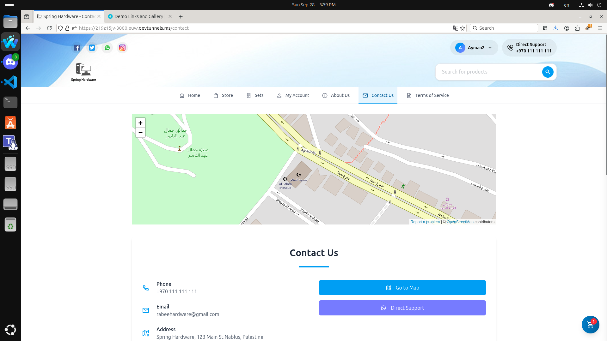
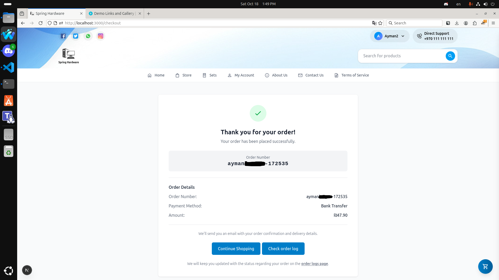
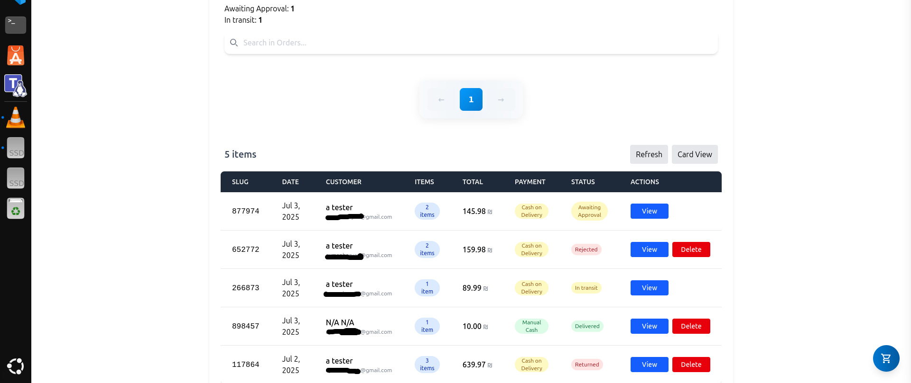
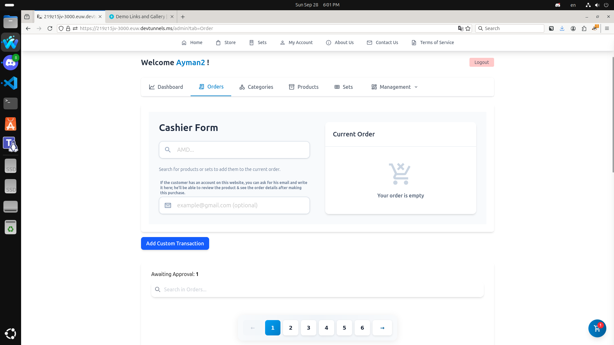
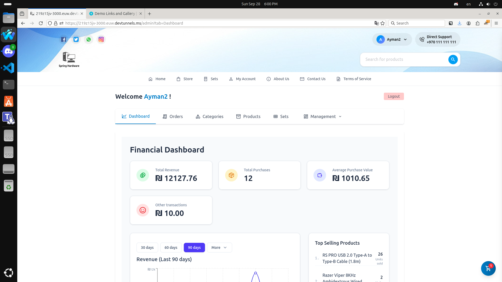
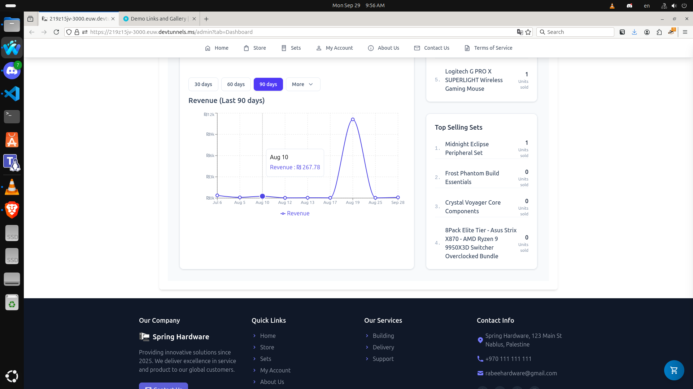

# Demo Links and Gallery

---

# Demo links

[Pc store template (EN) (soon..)](#)

[Books store template (AR) (soon..)](#)

---

# Gallery

**Note: Pictures are taken with full screen to avoid quality loss.**

...

### Homepage Featured Offers

### Homepage Featured Products

---

### Homepage Categories & Bestsellers

### Homepage Sets

---

### Homepage Promoted Categories Section

The Admin can chose any category to show here in its own list.

---

### Website Footer & Partners

---

### Store Page with Filters

---

### Store Page Product Grid

---

### Product Detail Page

---

### Product Page Recommendations

---

### Product Bundles Page

---

### Bundle Detail Page

---

### Bundle Components List

---

### Bundle Reviews

---

### User Account Overview

It will also show an icon if the account was made via Google.

---

### User Order History

---

### User Order Invoice

---

### User Wishlist

---

### About Us Page

---

### About Us - Store Gallery

---

### About Us - Team Section

---

### Image Gallery Lightbox

---

### Contact Us Page

---

### Terms of Service Page

---

### Shopping Cart Sidebar

---

### Checkout Page

---

### Order Confirmation Modal

---

### Order Success Page

---

### Live Search Results

---

### User Menu with Admin Link

---

### Order Confirmation Email

The images weren't appearing because the API was hosted at localhost:3000.

---

### Order Email Details

---

### Admin: Order Details

---

### Admin: Orders List

---

### Admin: Category Management

---

### Admin: Product Management

---

### Admin: Theme Settings

---

### Admin: Theme Color Submit

---

### Admin: General Settings

---

### Admin: Discount Calculator

---

### Admin: HTML Editor

---

### Access Denied Page

---

### Login Page

---

---

### User Order Status Update

---

### Admin: Cashier/POS Interface

You can also write any hidden info about the product in the forms (e.g. The location of the product in the store) and you'll see it here

---

### Admin: Financial Dashboard

<!-- This chart has fake records for testing purposes, unrelated to other cards. -->

---

### Admin: Backup Management

---

### Admin: Discount Code Creation

---

### Product Customer Reviews

---

### Spamming management

---

### Timed-out IP screen

---

# There are even more details to see on the website!

_Last updated on September 4, 2025 by Ayman._
