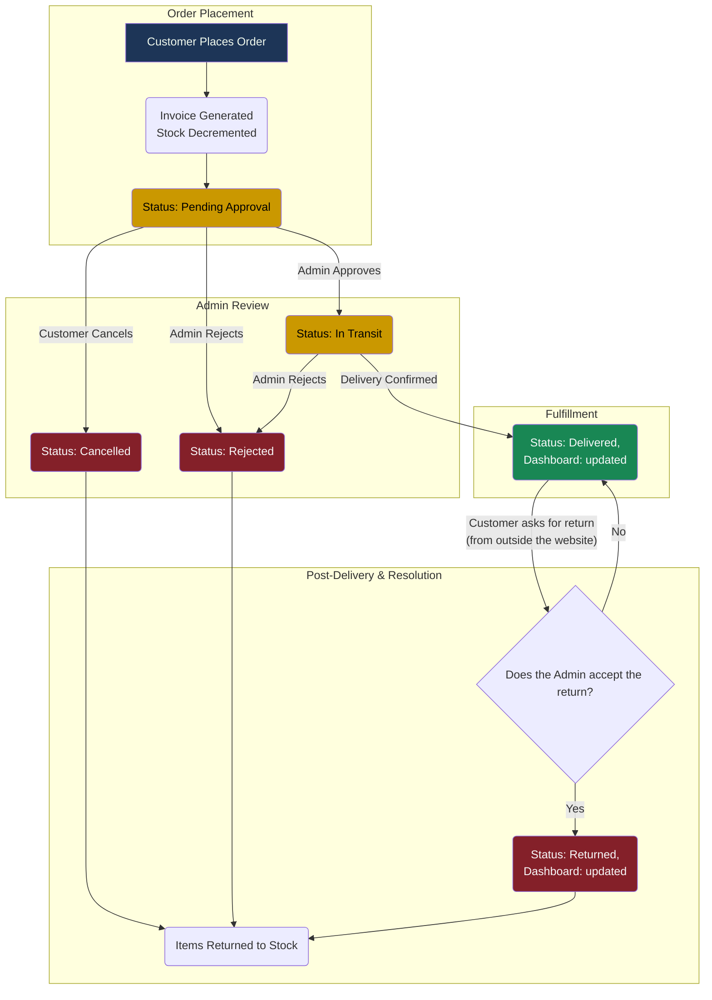

# Orders System

### Order Statuses

| Awaiting Approval | In Transit | Delivered | Cancelled | Rejected | Returned |
| :---------------- | :--------- | :-------- | :-------- | :------- | :------- |

---

### Order Management Lifecycle

:::note
Only the **financial report (Dashboard page)** will update if you delete a `Delivered` Order log, but the item's quantity & selling counter won't change; you must **reject** the order to return the items' numbers & sold items counter.

And if you delete the order log, the user won't be able to see it from their side or **review** the product.
:::

---

_Last updated on July 22, 2025 by Ayman._
