# Orders & Inventory System

### Order Statuses

| Awaiting Approval | In Transit | Delivered | Cancelled | Rejected | Returned |
| :---------------- | :--------- | :-------- | :-------- | :------- | :------- |

---

### Order Management Lifecycle

```mermaid
graph TD;
    subgraph "Order Placement"
        A[Customer Places Order] --> Y(Invoice Generated <br/> Stock Decremented)--> B(Status: Awaiting Approval<br/>📧 Purchase Email Sent);
    end
    subgraph "Admin Review & Management"
        B --> |Admin Approves| F(Status: In Transit<br/>📧 Status Email Sent);
        B --> |Admin Rejects| D(Status: Rejected<br/>📧 Status Email Sent);
        B --> |Customer Cancels| E(Status: Cancelled<br/>📧 Status Email Sent);
        B -.-> |Admin Edits Order| EDIT[Edit Order Items];
        F -.-> |Admin Edits Order| EDIT;
        EDIT --> |Items Updated| B2(Order Updated<br/>Stock Adjusted<br/>📧 Update Email Sent);
        B2 -.-> B;
    end
    subgraph "Fulfillment"
        F --> |Delivery Confirmed| G(Status: Delivered<br/>Dashboard: Updated<br/>📧 Status Email Sent);
        F --> |Admin Rejects| D;
    end
    subgraph "Post-Delivery & Resolution"
        G --> |"Customer Requests Return<br/>(External Process)"| H{Does Admin Accept Return?};
        H --> |Yes| K(Status: Returned<br/>Dashboard: Updated<br/>📧 Status Email Sent);
        H --> |No| G;
        E --> Z(Items Returned to Stock<br/>Discount Code Restored);
        D --> Z;
        K --> Z
    end
    %% Dark Mode Friendly Styles
    style A fill:#1d3557,color:#f1faee
    style B fill:#ca9800,color:#000
    style B2 fill:#457b9d,color:#f1faee
    style F fill:#ca9800,color:#000
    style G fill:#198754,color:#f8f9fa
    style D fill:#842029,color:#f8f9fa
    style E fill:#842029,color:#f8f9fa
    style K fill:#842029,color:#f8f9fa
    style EDIT fill:#457b9d,color:#f1faee
    style Z fill:#6c757d,color:#f8f9fa
```

---

### Email Notifications

The system automatically sends emails at key stages of the order lifecycle:

| Trigger                        | Email Type            | Recipient | Description                                          |
| ------------------------------ | --------------------- | --------- | ---------------------------------------------------- |
| Order Created                  | Purchase Confirmation | Customer  | Sent when customer places order (except manual_cash) |
| Status: Approved → In Transit  | Status Update         | Customer  | Notifies customer order is being shipped             |
| Status: In Transit → Delivered | Status Update         | Customer  | Confirms successful delivery                         |
| Status: Rejected               | Status Update         | Customer  | Notifies customer of order rejection                 |
| Status: Cancelled              | Status Update         | Customer  | Confirms order cancellation                          |
| Status: Returned               | Status Update         | Customer  | Confirms return processing                           |
| Order Items Edited             | Order Update          | Customer  | Notifies customer of admin changes to order          |

:::info
All email notifications can be disabled by setting `sendEmail: false` in the function parameters. Admin notes included in status updates will be sent in the email when provided.
:::

---

### Admin Order Edit Functionality

Administrators can edit orders that are not in terminal status (rejected, cancelled, returned):

**What Can Be Edited:**

- Item quantities (increase/decrease)
- Product variants (swap one variant for another)
- Complete product changes (replace items entirely)
- Add or remove items from order

**Automatic Adjustments:**

- Stock levels recalculated for old and new items
- Order subtotal updated based on new items
- Shipping fees recalculated if order total crosses free delivery threshold
- Items sold counters updated (for delivered orders)
- Product total quantities recalculated

**Edit Workflow:**

1. Admin selects order to edit
2. Original items' stock is restored
3. New items' stock is decremented
4. Order totals recalculated
5. Customer receives email notification
6. Database updates broadcast

:::warning
**Restrictions:**

- Cannot edit orders with status: `rejected`, `cancelled`, or `returned`
- All new items must have sufficient stock available
- At least one valid item must remain after edit
  :::

---

### Special Order Types

**Manual Cash Orders:**

- Created with status: `delivered` (bypasses approval)
- No purchase email sent
- No shipping fee calculation (region set to "N/A")
- Items sold counter immediately incremented
- Available only to admin users

---

### Stock & Inventory Management

**On Order Creation:**

- Product variant quantities decremented
- Set component quantities decremented (if applicable)

**On Order Edit:**

1. Original items returned to stock
2. New items deducted from stock
3. Product total quantities recalculated

**On Order Cancellation/Rejection/Return:**

- All items returned to stock
- Discount code usage count decremented
- Items sold counter decremented (if order was delivered)

**Items Sold Counter:**

- Incremented only when order reaches `delivered` status
- Decremented when delivered order is rejected, cancelled, or returned
- Updated during order edits for delivered orders

---

:::note
**Important Notes:**

- Only the **financial report (Dashboard page)** will update if you delete a `Delivered` Order log, but the item's quantity & selling counter won't change; you must **reject** the order to return the items' numbers & sold items counter.
- If you delete the order log, the user won't be able to see it from their side or **review** the product.
- Order edits trigger stock adjustments, email notifications, and database broadcasts automatically.
- Discount codes are validated for expiry, usage limits, and minimum order amounts during order creation.
  :::

---

_Last updated on January 21, 2026._
